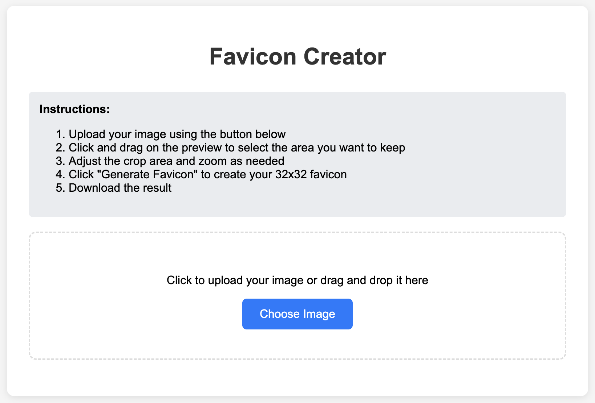

# Favicon Creator

A simple, browser-based tool for creating 32x32 pixel favicons from any image. No server required - runs entirely in the browser using HTML5 Canvas.



## Features

- **Drag & Drop or Click to Upload** - Easy image uploading
- **Interactive Cropping** - Click and drag to select the exact area you want
- **Square Crop Enforcement** - Automatically maintains square aspect ratio for proper favicons
- **Zoom Controls** - Fine-tune your selection with zoom in/out
- **Real-time Preview** - See exactly how your favicon will look at 32x32 pixels
- **High-Quality Downsampling** - Uses canvas smoothing for crisp, clear results
- **Instant Download** - Generate and download your favicon.png immediately

## Usage

1. **Open `index.html`** in any modern web browser
2. **Upload your image** by clicking "Choose Image" or dragging and dropping
3. **Select the area** you want by clicking and dragging on the preview
4. **Adjust zoom** if needed to get the perfect framing
5. **Generate favicon** and download your 32x32 pixel PNG file

## Installation

No installation required! Simply download or clone this repository and open `index.html` in your browser.

```bash
git clone https://github.com/yourusername/favicon-creator.git
cd favicon-creator
# Open index.html in your browser
```

## Browser Compatibility

Works in all modern browsers that support:

- HTML5 Canvas
- File API
- Blob URLs

Tested on:

- Chrome 90+
- Firefox 88+
- Safari 14+
- Edge 90+

## Technical Details

- **Output Format**: PNG
- **Output Size**: 32x32 pixels
- **Input Formats**: Any image format supported by the browser (JPG, PNG, GIF, WebP, etc.)
- **Processing**: Client-side only - no data is sent to any servers

## How It Works

1. **Image Upload**: Uses the File API to read uploaded images
2. **Canvas Rendering**: Draws the original image to an HTML5 canvas
3. **Interactive Cropping**: Mouse events track user selection for crop area
4. **Downsampling**: Creates a temporary canvas to extract the cropped area, then renders it at 32x32 pixels with high-quality smoothing
5. **Download**: Converts the final canvas to a PNG blob and creates a download link

## File Structure

```
favicon-creator/
├── index.html          # Main application file
├── README.md          # This file
└── screenshot.png     # Optional screenshot for documentation
```

## Customization

The tool is built with vanilla JavaScript and can be easily customized:

- **Change output size**: Modify the favicon canvas dimensions and the final output size
- **Add formats**: Extend to support ICO or other favicon formats
- **Styling**: Update the CSS for different visual themes
- **Additional features**: Add batch processing, multiple sizes, etc.

## Contributing

Feel free to submit issues and enhancement requests! Pull requests are welcome.

## License

MIT License - feel free to use this in your own projects.

## Why Use This?

- **Privacy**: All processing happens locally in your browser
- **No Dependencies**: No frameworks or external libraries required
- **Fast**: Instant processing and download
- **Free**: No subscriptions or usage limits
- **Offline Capable**: Works without an internet connection once loaded

## Tips for Best Results

- Use high-resolution source images (at least 256x256)
- Choose images with good contrast and clear details
- Avoid very complex images that won't be visible at 32x32 pixels
- Test your favicon in a browser to ensure it looks good at actual size

---

Created with ❤️ for developers who need quick, simple favicon generation.
